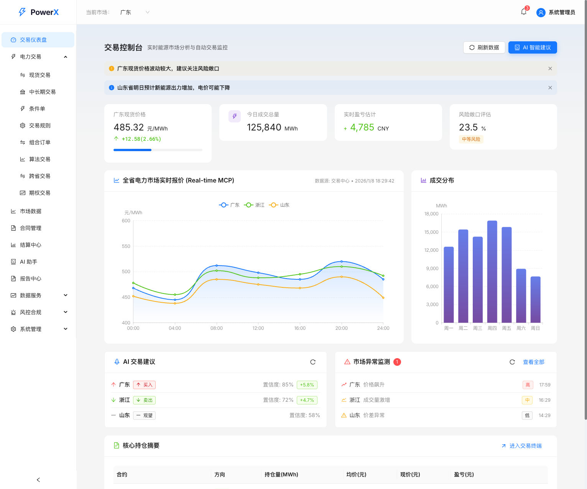
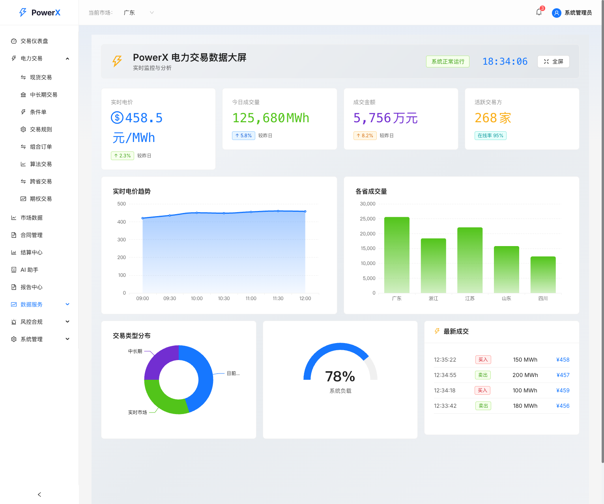
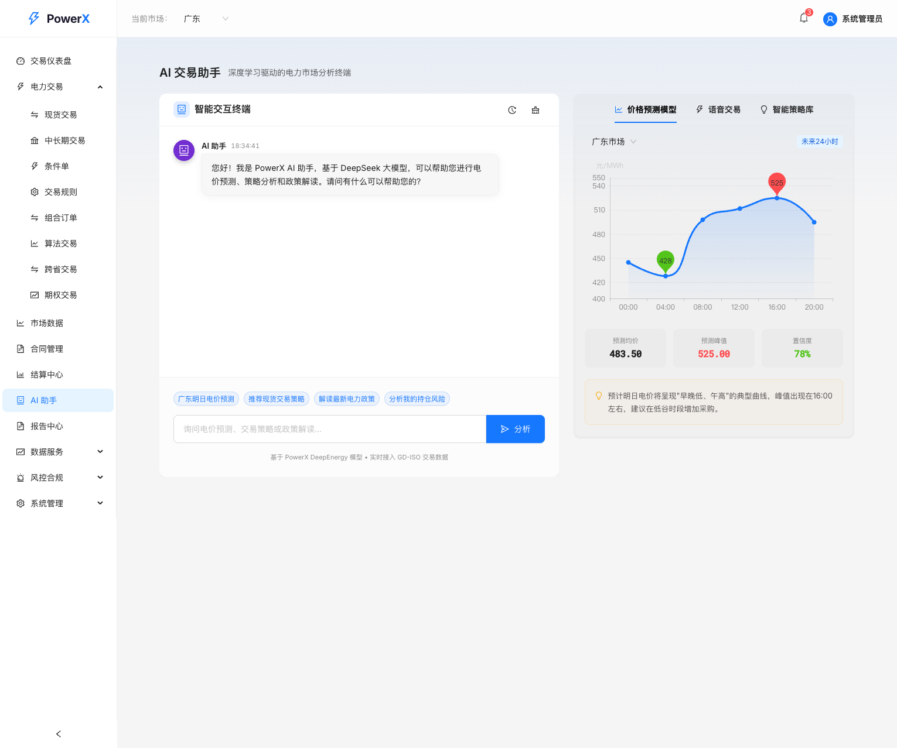
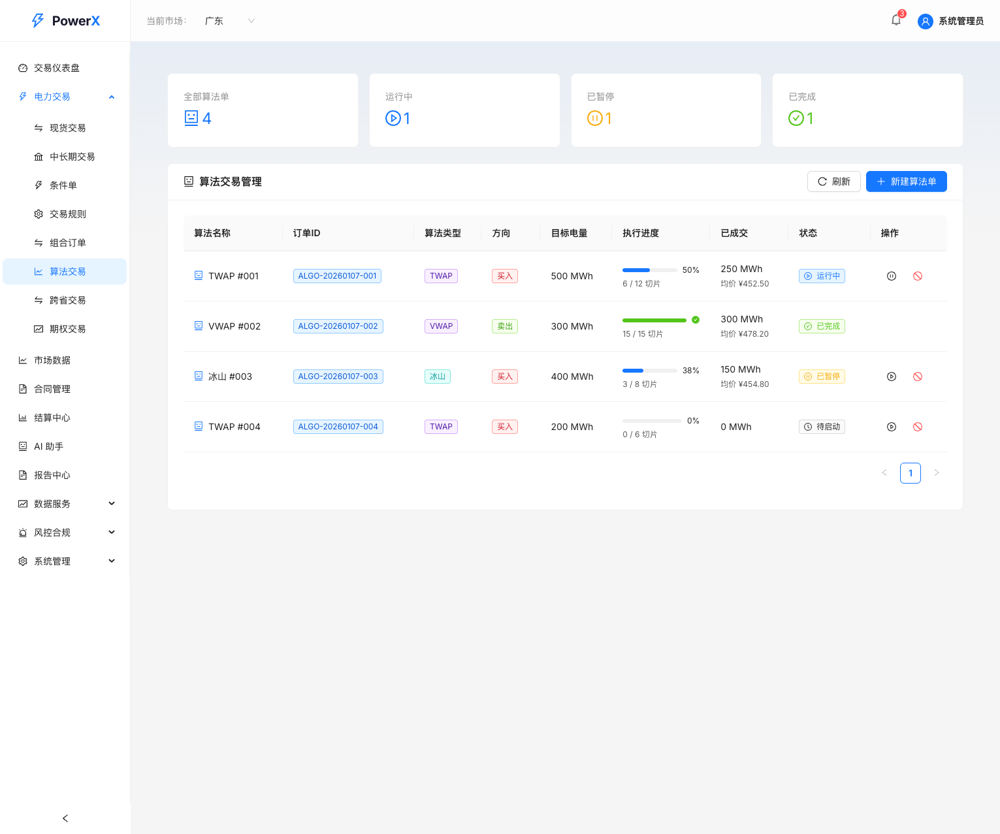

# ⚡ PowerX

> AI 赋能的中国电力市场智能交易系统

基于 DeepSeek 大模型，为电力交易员提供智能辅助决策。支持电价预测、策略推荐、风险评估、自动报告生成。

<p align="center">
  
</p>

## 快速开始

```bash
# 克隆项目
git clone https://github.com/kidcrazequ/powerX.git
cd powerX

# Docker 一键启动（推荐）
cd docker && docker-compose up -d

# 或手动启动
cd backend && pip install -r requirements.txt && uvicorn main:app --reload
cd frontend && npm install && npm run dev
```

访问 http://localhost:3000 开始使用。

## 功能展示

### 交易仪表盘

实时监控电价走势、成交分布、AI 交易建议和持仓情况。

<p align="center">
  
</p>

### 数据大屏

全屏可视化展示电力交易数据，支持实时刷新。

<p align="center">
  
</p>

### AI 交易助手

基于 DeepSeek 大模型的智能问答，支持电价预测、策略分析和政策解读。

<p align="center">
  
</p>

### 算法交易

支持 TWAP、VWAP、冰山订单等算法策略，自动拆分大单执行。

<p align="center">
  
</p>

## 支持省份

| 省份 | 现货市场 | 价格机制 | 特点 |
|------|:--------:|---------|------|
| 广东 | ✅ | 节点电价 | 15分钟结算 |
| 浙江 | ✅ | 统一出清 | 高频交易 |
| 山东 | ✅ | 统一出清 | 允许负电价 |
| 山西 | ✅ | 统一出清 | 煤电为主 |
| 甘肃 | ✅ | 统一出清 | 新能源外送 |

## 技术栈

**后端**: Python 3.11 · FastAPI · PostgreSQL · Redis · DeepSeek API · Celery

**前端**: React 18 · TypeScript · Ant Design · ECharts · Zustand · Vite

## 核心功能

| 功能 | 说明 |
|------|------|
| 🔮 电价预测 | 基于历史数据和市场因素，预测 24 小时电价走势 |
| 💡 策略推荐 | 根据风险偏好和市场状态，自动生成交易策略 |
| 📚 政策解读 | RAG 知识库支持，智能解答电力市场政策问题 |
| 📊 风险评估 | 实时监控持仓风险，及时预警 |
| 📝 报告生成 | AI 自动生成日报、周报、月报 |
| 📈 算法交易 | TWAP/VWAP 策略、条件单、组合订单 |
| 🔐 安全合规 | 双因子认证、数据脱敏、IP 白名单 |
| 🌐 跨省交易 | 支持跨省电力交易管理 |

## API 文档

启动后端后访问：
- Swagger UI: http://localhost:8000/docs
- ReDoc: http://localhost:8000/redoc

## 项目结构

```
PowerX/
├── backend/           # FastAPI 后端服务
│   ├── app/
│   │   ├── api/       # API 端点
│   │   ├── ai/        # AI 模块
│   │   ├── models/    # 数据模型
│   │   └── services/  # 业务逻辑
│   └── tests/         # 测试文件
├── frontend/          # React 前端应用
│   └── src/
│       ├── pages/     # 页面组件
│       ├── components/# 通用组件
│       └── stores/    # 状态管理
├── docker/            # Docker 配置
└── k8s/               # Kubernetes 配置
```

## 测试

```bash
# 后端测试
cd backend && pytest

# 前端测试
cd frontend && npm test
```

## 支持

- ⭐ 如果 PowerX 对你有帮助，欢迎 Star 支持
- 🐛 发现问题？欢迎提交 [Issue](https://github.com/kidcrazequ/powerX/issues)
- 🔧 想贡献代码？欢迎提交 [Pull Request](https://github.com/kidcrazequ/powerX/pulls)

## License

MIT License — 自由使用，欢迎参与开源贡献。

---

<p align="center">Made with ⚡ by PowerX Team</p>
